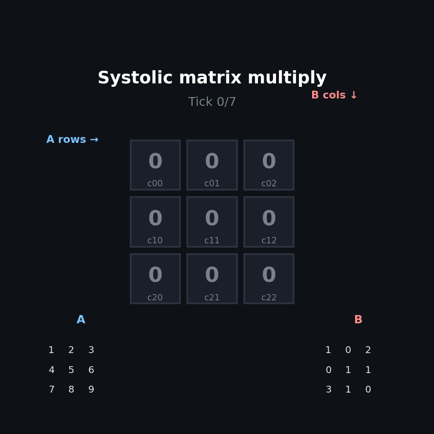

# systolic-array

A tiny Python simulation of a 2D systolic array doing matrix multiply, tick by tick.

About 80 lines of logic. No NumPy, no parallelism, no hardware. Just a grid of
cells that pulse on a global clock and pass data to their neighbours. Numpy is
only pulled in by the tests to verify the answer.

I wrote this after reading the 1978 Kung-Leiserson paper that every modern AI
chip traces back to. The TPU, Tensor Cores, Cerebras, they're all the same
diagram, scaled up and burned into silicon. Wanted to feel the rhythm of the
thing on a 3x3 example before pretending to understand the 256x256 version.

## Demo



```bash
python3 run.py
```

Multiplies a sample 3x3 by 3x3 and prints the grid state at every clock tick.
You see the accumulators in each cell fill in as A's flow right and B's flow
down.

```
=== Clock tick 6 ===
  [  10.0,    5.0,    4.0]
  [  22.0,   11.0,   13.0]
  [  34.0,   17.0,   22.0]
```

## Tests

```bash
python3 test_systolic.py
```

Five tests. Two on the input staggering, one 2x2 by hand, one identity check,
and one against numpy for a random 3x3.

## How it works

A 2D grid of `Cell` objects. Each cell holds one accumulator `c_ij`.

Every clock tick, each cell:

1. Reads an `a` value arriving from its left and a `b` value arriving from above
2. Does `c_ij += a * b`
3. Passes that `a` to the right neighbour and the `b` to the cell below

```
        B flows down
       b00  b01  b02
        |    |    |
        v    v    v
A ->  +----+----+----+
a0->  | c  | c  | c  |
      +----+----+----+
a1->  | c  | c  | c  |
      +----+----+----+
a2->  | c  | c  | c  |
      +----+----+----+
```

The trick is staggering the inputs so each cell sees the right `a` and `b`
on the right tick. Row `i` of A enters with `i` leading nulls, same for column
`j` of B. After about `3n - 2` ticks the whole product sits in the grid.

`SystolicArray.tick()` is two-phase: compute everywhere, then propagate. Doing
it in one phase races, because cell (i, j+1) would clobber its neighbour's input
before the neighbour read it.

## Why this is interesting

Naive matmul reads each element of A and B about `n` times. The systolic version
reads each element once at the edge of the grid, then reuses it across every
cell it needs to visit on the way through. That is the whole reason this
pattern is on every AI chip in production: matmul bandwidth, not flops, is the
bottleneck, and a grid like this is the cheapest way to hide it.

The cell logic here is the exact arithmetic a Tensor Core does in hardware. The
hardware version just runs 4x4 of them per GPU core, at billions of ticks per
second, in metal instead of Python lists.

## Files

```
systolic.py        cell, array, staggering, top-level matmul
run.py             3x3 demo with per-tick grid dump
test_systolic.py   5 tests, last one cross-checks against numpy
```

## Not done

- Rectangular matrices (m x k by k x n)
- A coloured terminal animation of the data flow
- A Verilog port simulated with Verilator
- Comparison with the hex array layout from the original paper (this uses the
  simpler square equivalent)
